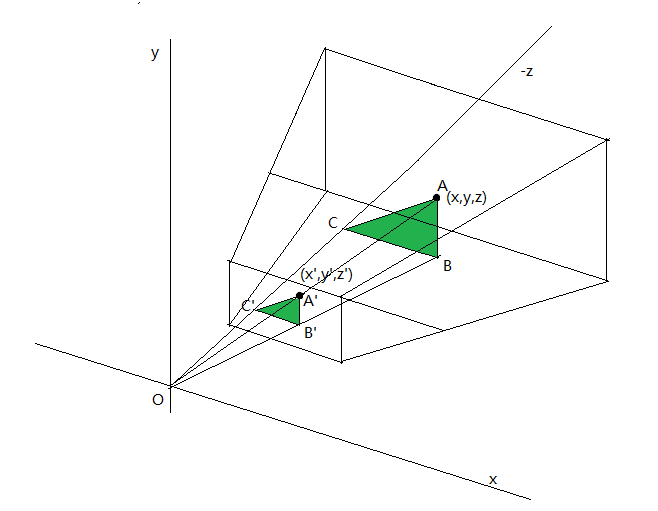
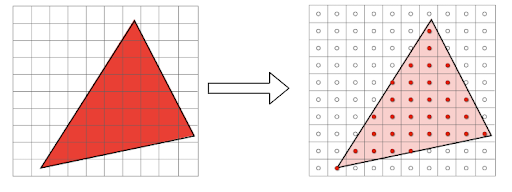

## The Graphics Rendering Pipeline [Back](../glsl.md)

### 1. The Graphics Rendering Pipeline

Similar to CPU, GPU has also accepted some generic orders and data as input, which must follow a path where they will pass through some stages. This path is so called **The Graphics Rendering Pipeline**.

In the early OpenGL years, this pipeline was completely fixed, which means that all data should pass through the same operations inside this pipeline, and could not skip some of them. These were the pre-shader ages (2002 and earlier).

For example, the following figure has shown how data flows through:

Between 2002 and 2004, programmable pipeline has arise to support replacing some of the fixed stages in the rendering pipeline. However, the language of programing solution has not been unified when developers should code **Cg** (from NVidia) or **HLSL** (from Microsoft).

To realize the importance of compatibilities through different platforms **OpenGL Shading Languages (GLSL)** was born to support developers by a unique C-like shader. In that year, there was only two pieces of units could be replaced: the **vertex processing unit** (vertex shaders, 頂點著色器) and the **fragment processing unit** (fragment shaders, 片面著色器). Another two unis were added later: **geometry shaders** (幾何著色器) in 2008 and **compute shaders** (計算著色器) in 2012 respectively.

Since that, the pipeline has changed to this:

#### 1.1 Geometry Stages

This stage mainly focuses on the transformation of vertex data from its initial state (model coordinates system) to its final state (viewport coordinates system):

- **Vertex data** (頂點數據): all vectorial (矢量) data of geometries like vertices (頂點), normals (法綫), indices (指數), tangents (切綫), binormals (副法綫), texture coordinates (紋理坐標), etc.
- **Texture** (紋理): helps to make renders colorful by displacing vertices according to values stored into a texture.
- **Vertex shader**: responsible for the transformation of the vertices from a local coordinate system to the clip space.
- **Geometry shader**: generate new primitives using the outcome of the vertex shader.
- **Clipping**: clip new primitives and discard outside the clip space.
- **Perspective division** (透视分割): convert our visualization volume into a regular and normalized cube:

  

- **Viewport transform**: translate the cube above and scaled to the viewport coordinates, like our screen or window.
- **Rasterizer** (光柵化): transform vectorial data to a discrete representation (離散表徵):

  

#### 1.2 Fragment Stages

This stage presents the discrete data:

- **Fragment shader**: calculate texture, colors, and lights that applied and combined to form a fragment.
- **Post-fragment processing**: this process includes blending, depth tests, scissor tests, alpha tests, etc. If finally pass, the fragment will be written to the framebuffer (幀緩衝區).

#### 1.3 External Stages

This stage has include the computer shader stage, which can be written to affect any other programmable part of the Graphic Rendering Pipeline.

### 2. Types of shaders

**Vertex shader** and **fragment shader** are both the most important shaders in the whole pipeline, and we can control almost anything in our rendering process via these two shaders. However, enhancement room exists where we can use **Geometry shader** to create arbitrary shaped primitives (多邊形), like quads, and transform only one vertex (the quad's center) instead of four vertices.

Unlike vertex shader and fragment shader, the Geometry one is optional which means that you can just skip it in your pipeline. The **Computer shader** is also optional.

As OpenGL evolving everyday, the types of shaders may change according to a certain requirement, like **Tessellation shaders** (細分(鑲嵌)著色器).

#### 2.1 Vertex shaders

In such a shader, we can perform any type of data transform, such as apply noise to the positions for a pseudorandom displacement, calculate normals, calculate texture coordinates, calculate vertex colors, prepare the data for a normal mapping shader, and so on.

*Notice: A vertex shader is actually a snippet of code run in GPU processors, and assume that we have a 3D model with 1000 vertices, the vertex shader (code) will be executed 1000 times.*

#### 2.2 Fragment shaders

In such a shader, we can control how to paint each primitive's area by outputting an RGBA color, which can be calculated from textures, or vertex shader's output data. Like vertex shader, fragment shader is also actual a snippet of code, executed in any single pixel of a fragment, but the reality is even worse when doing post-processing shaders such as motion blur (動態模糊), glows (光暈), or screen space ambient occlusion (環境光遮罩), resulting in executing fragment shader in any relational fragment. That's why it is more essential to optimize in fragment shaders than in vertex shaders.
